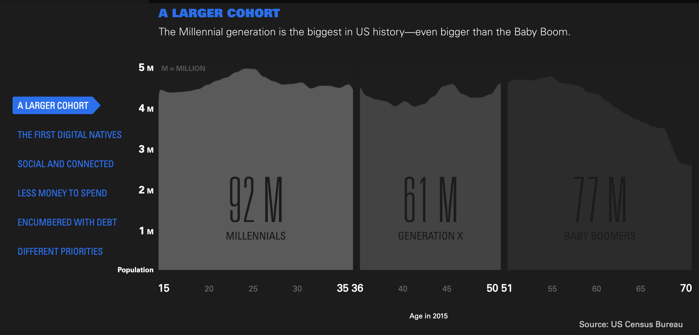

# Robinhood App - Disrupting the Trading Industry
 
## Overview and Origin

### Name of company 
- Robinhood Markets, Inc. is an private American financial services company headquartered in Menlo Park, California

The company offers a mobile app and website that offer people the ability to invest in stocks, ETFs, and options 
through Robinhood Financial and crypto trading through Robinhood Crypto.
Robinhood operates a website and mobile apps for iPhone, Apple Watch, and Android.
The company has no storefront branches and operates entirely online without fees

The company's main source of revenue comes from interest earned on customers' cash balances, 
selling order information to high-frequency traders (a practice for which SEC opened a probe into the company in September 2020) 
and margin lending. The company has 13 million users.

### When was the company incorporated?
Robinhood was founded in April 2013 , 
The app was then officially launched in March 2015

### Who are the founders of the company?
by Vladimir Tenev and Baiju Bhatt 
Key people Jason Warnick (CFO) Gretchen Howard (COO)

### How did the idea for the company (or project) come about?
Robinhood’s story begins almost a decade ago at Stanford, where Baiju and Vlad met as roommates and classmates. 
After graduation they packed their bags for New York and built two finance companies, selling trading software to hedge funds. 
With their newfound experience in the world of finance, they realized that big Wall Street firms pay effectively nothing to trade stocks, 
while most Americans were charged commission for every trade. 
They soon decided it was more important to build products that would provide everyone with access to the financial markets, not just the wealthy. 
Two years after heading to New York, they moved back to California and built Robinhood—a company that leverages technology 
to encourage everyone to participate in our financial system.
The company's name comes from its mission to "provide everyone with access to the financial markets, not just the wealthy". Tenev noted that executing a trade cost brokerages "fractions of a penny" but they typically charged fees of $5 to $10 per trade, as well as required account minimums of $500 to $5,000

### How is the company funded? How much funding have they received?
- Robinhood has raised a total of $1.7B in funding over 15 rounds

    -  Announced Date  Transaction Name    Number of Investors     Money Raised    Lead Investors
    - Aug 17, 2020 | Series G | $200M | D1 Capital Partners
    - Jul 13, 2020 | Series F | $320M | IVP, TSG Consumer Partners

    - Jul 1, 2020  | Secondary Market    

    - May 4, 2020  | Series F | $280M  | Sequoia Capital

    - Oct 29, 2019	Series E            1	                    $50M	        DST Global

    - Sep 17, 2019	Secondary Market    1	                    $2.3M	        —

    - Jul 22, 2019	Series E            7	                    $323M	        DST Global

    - Feb 1, 2019	    Secondary Market    4	                    —	            —

    - May 10, 2018	Series D            5	                    $363M	        DST Global

    - Apr 26, 2017	Series C            7	                    $110M	        DST Global

Robinhood is funded by 55 investors. D1 Capital Partners and IVP are the most recent investors.
Investor Name (non-exahustive)      Funding Round           
- D1 Capital Partners                 Series G 
- IVP                                 Series F 
- TSG Consumer Partners               Series F 
- Sutton Capital                      Series F
- Manhattan Venture Partners 	        Secondary 
- Market 
- 9Yards Capital                      Series F
- Sequoia Capital                     Series F 
- Ribbit Capital                      Series F 
- New Enterprise Associates           Series F
- Unusual Ventures                    Series F
- DST Global                          Series C
- Greenoaks Capital                   Series C
- Thrive Capital                      Series C

## Business Activities:

### What specific financial problem is the company or project trying to solve?

Robinhood is a stock brokerage that allows customers to buy and sell stocks, options, ETFs, and cryptocurrencies with zero commission.
Robinhood started with a simple idea: using technology, we can re-think the way financial services operate. 
The company's name comes from its mission to "provide everyone with access to the financial markets, not just the wealthy". 
As per one of Robinhood's funders "executing a trade cost brokerages "fractions of a penny" but they typically charged fees of 
$5 to $10 per trade, as well as required account minimums of $500 to $5,000"

### Who is the company's intended customer?  
What solution does this company offer that their competitors do not or cannot offer? (What is the unfair advantage they utilize?)

Their Marketing approach roots in the company's brand name "the outlaw from English folklore, who stole from the rich and gave to the poor" 
Their "customer persona" are essentially "millenials" and new entrants to the stock market. 
Robinhood, mostly used by millennials to trade stocks and cryptocurrency, has grown from its 1 million subscribers in 2016 and 
6 million accounts in October of 2018. 
More than half of Robinhood customers are opening their first brokerage account, and the median customer age is 31 years old, according to the company.
Fifty percent of users who have made a trade use the app daily and 90% use the app weekly.
According to different sources Robinhood currently has between 10M and 13M

Robinhood co-CEO Baiju Bhatt told CNBC in a phone interview: 
    “We’ve seen a major paradigm shift for broader financial services. 
    People that previously didn’t feel like the markets were for them are for the first time feeling a sense of inclusivity.”

### Is there any information about the market size of this set of customers?

Born between 1980 to 2000, the Millennial generation is the largest in US history (92M), larger than baby boomers (77M) 

Millennials have come of age during a time of technological change, globalization and economic disruption, and have set of priorities and expectations sharply different from previous generations.
They’re the first generation of digital natives, and their affinity for technology helps shape how they act. They are used to instant access to information and peer reviews.

### Which technologies are they currently using, and how are they implementing them? 
Robinhood started with a simple idea: *"using technology, we can rethink the way financial services operate"*

We cut out the fat that makes other financial services costly — legacy technology, hundreds of storefront locations, and paper-based accounting. 
And as a result, we radically reduce costs.

- Products that make up Robinhood’s tech stack include: 
Application & Data: Python, nginx, React, Bootstrap, PostgreSQL, Ubuntu, Redis, Amazon (EC2, Route 53), Sass, Django, Redux, RabbitMQ,
Kafka, Go, Swift, Memcached, Kotlin, Celery, Airflow, RxJava, Faust 
- Utilities: Google Analytics, Elasticsearch, Retrofit 
- DevOps: GitHub, Git, Docker, Jenkins, Kubernetes, Webpack, Kibana, Babel, Sentry, Vagrant, Grafana, Terraform, Logstash, Prometheus,
Consul, Zookeeper, ELK, Vault, Fabric, Salt, StatsD, Phabricator, Sensu, LXC 
-   Business Tools: Slack, G Suite, Confluence, Asana 

## Landscape:

* What domain of the financial industry is the company in?

- ***Robinhood is Stockbroker and Electronic trading platform***

- The is a FINRA regulated broker-dealer, registered with the U.S. Securities and Exchange Commission, and is a member of the Securities Investor Protection Corporation.

### What have been the major trends and innovations of this domain over the last 5-10 years?
In the “old world,” brokers, as members and owners, controlled the exchanges. Exchanges had monopoly on liquidity and brokers controlled access. 
By providing investors access to markets, brokers earned commissions and also received trading fee rebates from the exchange. Brokers thus competed on the basis of service and relationships, rather than price.

The introduction of negotiated commissions in the U.S. in 1975 marked the beginning of constantly increasing competition for brokers. 
In the last 10-15 years, this process accelerated and Capital Markets have experienced a disruption  driven by technology
Electronic trading has dramatically increased trading volumes and liquidity and slashed the cost of intermediation and broadened access to markets.  
In many ways, brokers and exchanges now compete with each other.
The emerging technologies in the financial services industry have impacted almost all the business aspects in the years after 2010. 
Regulations are also evolving and adaptiving to this new world, and processes have become more transparent
Technology-led (FinTech) innovation in products and services are disrupting the financial markets and challenging the tradicional business model e.g. "0 commisions - RobinHood" 
The FinTech market is continuously growing, valued  at $127.66 billion in 2018 and is expected to reach $309.98 billion by 2022. 
Technological innovations are affecting all areas and departments of brokers and exchanges ...
strategy, operations, technology, security, finance, marketing. 
New customers, especially Millennials and new entrants, have also changed the trends in the demand for new services, by using new technological means of iteration, in real time and through new channels of product marketing 
Technologies such as Artificial Intelligence, Machine Learning, Data Analysis, Blockchain, Crytocurrencies, Internet of Things, Mobile Technology, Cloud Computing, DevOps, CyberSecurity are now at the core of Financial Services Systems, including Brokers and Exchanges and these technologies will certantly be driving the future in this domain

### What are the other major companies in this domain?

- TradeStation --> Active Stock Traders
- TD Ameritrade --> TD Ameritrade offers free stock, and ETF trades are also available. Like Robinhood, TD Ameritrade offers zero account fees. Unlike Robinhood, TD Ameritrade offers a large selection of financial services. TD Ameritrade’s mobile platform far exceeds Robinhood’s app
- Firstrade --> For Online Traders
- M1 Finance --> A hybrid robo/self-directed brokerage firm, M1 Finance offers free investing. M1 offers financial management that incorporates features of both automated investing and self-directed strategies 
- Webull --> Probably the main Robinhood's competitor. It has the same $0 commission on stocks, options and ETFs. Unlike Robinhood, Webull offers an advanced trading platform, IRA accounts, and simulated trading
- Merrill Edge --> Is Bank of America’s on-line discount brokerage arm. It normally offers stock and ETF trades at $0. Bank of America/Merrill Edge programs, and they come with a host of other benefits
- Betterment 
- Interactive Brokers --> for Advanced Traders 

## Results

### What has been the business impact of this company so far?
- Robinhood has grown to ~10 million users since 2016.
- The start-up, launched in 2013 with a free-trading model, was mimicked by brokerage firms such as Charles Schwab, Fidelity, TD Ameritrade. 
- Robinhood has boosted its valuation to $8.3 billion, even after its *trading technology stumbled badly during the coronavirus crash*. 

### What are some of the core metrics that companies in this domain use to measure success? How is your company performing, based on these metrics?

Some key KPIs are:
- Number of clients/users 
- Client Retention Rate.
- Assets Under Management (AUM) per Employee.
- Total AUM Inflows & Outflows.
- Return on Assets (ROA)
- Trade Break Rate (by Asset Class/Type)
- Cost per Trade (by Asset Class/Type)

### How is your company performing relative to competitors in the same domain?
Robinhood does not publish its trading statistics the way all other brokers do, so it's hard to compare its payment for order flow statistics to anyone else. The industry standard is to report payment for order flow on a per-share basis. Robinhood reports on a per-dollar basis instead

As per available information, the company’s lifetime revenue to date is between $600 and $650 million, while 20-25% of its current income comes from interest on customer accounts and 55% from so-called order flow—rebates 
This still leaves the question of how the company plans to make profit. There is also the question of how many of their ~10 million accounts are active, and how much money the average one contains. 
Robinhood's profitable competitors are *eTrade or Charles Schwab.*

## Recommendations

### If you were to advise the company, what products or services would you suggest they offer? (This could be something that a competitor offers, or use your imagination!)

- Limited securities: Mutual funds and bonds aren't supported. 

- One account option: For investing, Robinhood supports only individual taxable accounts (brokerage account). 

- Customer support/service  Robinhood's customer support is almost exclusively done through email. The company does not publish a phone number. 

- Education and Risk Management tools 

### Why do you think that offering this product or service would benefit the company?

- Customer support:  Robinhood's customer support is almost exclusively done through email. For the type of clients / users they have, I think it would be a good service that could be a mix of robotization and consultation

- Education and Risk Management tools: Robinhood faced controversy in June 2020 after student Alexander E. Kearns (20 years old), University of Nebraska, committed suicide after seeing a negative cash balance of U.S. ~$700k in his Robinhood trading account. 

### What technologies would this additional product or service utilize? Why are these technologies appropriate for your solution?

- Artificial Intelligence, Machine Learning, Deep Learning, Mobile App, Chatbot app

### ***Resources***
- https://en.wikipedia.org/wiki/Robinhood_(company) (Wikipedia page)
- https://about.robinhood.com/
- https://www.bloomberg.com/news/features/2018-02-08/brokerage-app-robinhood-thinks-bitcoinbelongs-in-your-retirement-plan (tales of the growth of RobinHood, including comparison with
Amazon)
- https://www.investopedia.com/robinhood-review-4587919 
- https://support.robinhood.com/hc/en-us/articles/360001397126-What-s-Clearing-by-Robinhood
- https://www.cnbc.com/2018/05/11/how-commission-free-trading-app-robinhood-tries-to-makemoney.html 
- https://siftery.com/company/Robinhood?utm_campaign=Robinhood&utm_medium=techstack&u
tm_so urce=quora 
- https://fortune.com/2019/12/04/red-flags-for-robinhood/
- source: https://www.crunchbase.com/organization/robinhood/company_financials
- https://opsdog.com/categories/kpis-and-metrics/broker-dealer
- https://www.cnbc.com/2020/06/17/robinhood-drives-retail-trading-renaissance-during-markets-wild-ride.html
- https://www.benzinga.com/money/robinhood-alternatives/
https://www.brokerage-review.com/better-compare/competitors/robinhood-vs-competition.aspx
- Forbes, https://www.forbes.com/sites/advisor/2014/04/16/the-brokerage-world-is-changing-who-will-survive/#12466e0268a7
- Protiviti, Top Technology Trends in Financial Services Organizations, https://www.protiviti.com/US-en/insights/top-technology-trends-financial-services-organizations
- KelltonTech, Financial Services Technology Trends in 2020, https://www.kelltontech.com/kellton-tech-blog/top-7-financial-services-technology-trends-2020
- Gartner, Future of Finance, https://www.gartner.com/en/finance/trends/future-of-finance?ef_id=EAIaIQobChMI0874jL3n6wIVBdvACh2O9gdmEAAYASAAEgJyDPD_BwE:G:s&utm_source=google&utm_medium=cpc&utm_campaign=RM_NA_2020_FINL_CPC_LG1_SEM-FIN-H2-FUTURE-FI&utm_adgroup=104943784941&utm_term=%2Bfinance%20%2Btrends&ad=461494659584&gclid=EAIaIQobChMI0874jL3n6wIVBdvACh2O9gdmEAAYASAAEgJyDPD_BwE
- PWC, Financial services technology 2020 and beyond: Embracing disruption, https://www.pwc.com/gx/en/industries/financial-services/publications/financial-services-technology-2020-and-beyond-embracing-disruption.html
- https://www.pwc.com/gx/en/financial-services/assets/pdf/technology2020-and-beyond.pdf
- https://stackshare.io/robinhood/robinhood
- https://www.goldmansachs.com/insights/archive/millennials/
- https://www.cnbc.com/2020/06/17/robinhood-drives-retail-trading-renaissance-during-markets-wild-ride.html#:~:text=Robinhood%2C%20mostly%20used%20by%20millennials,old%2C%20according%20to%20the%20company.